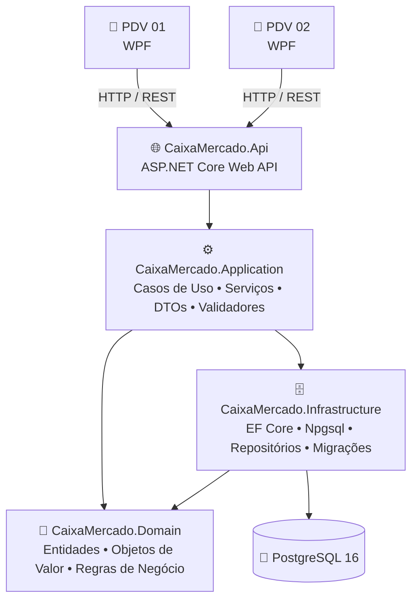

<div align="center">

# 🛒 Caixa Mercado

### Frente de Caixa • Sistema PDV • Multicaixa

**Sistema desktop de alta performance para operação de caixa e gestão de varejo, com interface WPF, API centralizada em .NET 8 e persistência PostgreSQL.**

<br>

[](https://dotnet.microsoft.com/)
[](https://learn.microsoft.com/dotnet/csharp/)
[](https://learn.microsoft.com/dotnet/desktop/wpf/)
[](https://dotnet.microsoft.com/apps/aspnet)
[](https://www.postgresql.org/)
[](https://learn.microsoft.com/ef/core/)
[](https://swagger.io/)
[](LICENSE)

<br>

**Clean Architecture** · **DDD** · **MVVM** · **REST API** · **Multicaixa** · **Light / Dark Mode**

</div>

---

## 📌 Sobre o projeto

O **Caixa Mercado** é um sistema completo de **Frente de Caixa (PDV)** e **Gestão de Varejo**, desenvolvido especialmente para **minimercados, padarias, açougues e comércio local**.

A solução combina uma aplicação desktop **WPF** rápida e ergonômica para os operadores de caixa com uma **API centralizada em .NET 8**, permitindo a operação de múltiplos PDVs conectados ao mesmo backend e banco de dados **PostgreSQL**.

O projeto foi estruturado com **Clean Architecture** e princípios de **Domain-Driven Design (DDD)**, mantendo as responsabilidades bem separadas entre domínio, aplicação, infraestrutura, API e interface desktop.

---

## ✨ Principais destaques

| Área | Implementação |
|---|---|
| 🖥️ **Interface Desktop** | Aplicação nativa em WPF, desenvolvida em XAML e C# |
| ⌨️ **Operação rápida** | Fluxo pensado para teclado e scanner, com atalhos visíveis durante a venda |
| 🛒 **Experiência de PDV** | Interface focada na rotina real de frente de caixa |
| 🎯 **Hierarquia visual** | Total da venda, pagamento e ações críticas possuem destaque próprio |
| 🌗 **Temas** | Light Mode e Dark Mode através de `ResourceDictionary` |
| 🧩 **Arquitetura** | Clean Architecture + DDD + MVVM |
| 🌐 **Multicaixa** | Clientes WPF conectados a uma API REST centralizada |
| 🗄️ **Persistência** | PostgreSQL 16 + Entity Framework Core 8 |
| 📚 **Documentação da API** | Swagger / OpenAPI |
| 🧪 **Qualidade** | Testes com xUnit e FluentAssertions |

---

## 🎨 UX/UI do PDV

A interface foi desenhada priorizando **velocidade operacional, legibilidade e baixo atrito durante o atendimento**.

### Ergonomia operacional

- Operação otimizada para **teclado e leitor/scanner**.
- Informações principais com leitura rápida e contraste bem definido.
- Atalhos contextuais exibidos diretamente na interface.
- Campos personalizados em XAML para melhor alinhamento e experiência de uso.

### Scanner em estado vazio

Quando nenhuma venda está em andamento, o PDV utiliza um **estado vazio interativo** com:

- ícone de scanner de código de barras;
- iluminação laser animada com `SineEase`;
- retículo de alinhamento;
- anel de pulso indicando prontidão.

### Hierarquia visual

- **Total a Pagar:** painel de destaque com tipografia de `52px`.
- **Pagamento `[F9]`:** ação principal destacada visualmente.
- **Cancelamentos e remoções:** ações destrutivas diferenciadas em vermelho.
- **Temas dinâmicos:** suporte nativo a Light Mode e Dark Mode.

---

## 🧰 Tecnologias

<div align="center">
  
  &nbsp;&nbsp;&nbsp;
  
  &nbsp;&nbsp;&nbsp;
  
  &nbsp;&nbsp;&nbsp;
  
  &nbsp;&nbsp;&nbsp;
  
</div>

<br>

### 🖥️ Frontend / Cliente Desktop


- **WPF (Windows Presentation Foundation)** — interface desktop nativa construída em XAML.
- **C# / MVVM** — separação entre interface, estado e lógica de apresentação.
- **XAML / gráficos vetoriais** — ícones, scanner animado, estilos e elementos visuais.
- **ResourceDictionary** — sistema de temas dinâmicos Light e Dark.

### ⚙️ Backend / API


- **ASP.NET Core Web API** — serviço REST centralizado para operação multicaixa.
- **Swagger / OpenAPI** — documentação e testes interativos das rotas.
- **Clean Architecture / DDD** — separação entre `Domain`, `Application`, `Infrastructure` e `Api`.

### 🗄️ Banco de Dados & Persistência


- **PostgreSQL 16** — banco relacional utilizado pela solução.
- **Entity Framework Core 8** — ORM e gerenciamento das migrations.
- **Npgsql Provider** — integração entre EF Core e PostgreSQL.

### 🧪 Testes & Qualidade


- **xUnit** — testes unitários e de integração.
- **FluentAssertions** — asserções mais legíveis e expressivas.

---

## 🏗️ Arquitetura da solução

O sistema utiliza um modelo de **Monólito Modular Multicaixa**.



### 📂 Estrutura dos projetos

```text
Mercadinho/
├── src/
│   ├── CaixaMercado.Domain/
│   │   └── Entidades, interfaces, objetos de valor e validações
│   │
│   ├── CaixaMercado.Application/
│   │   └── Casos de uso, DTOs, mapeamentos e serviços de aplicação
│   │
│   ├── CaixaMercado.Infrastructure/
│   │   └── DbContext, EF Core, Fluent API, repositórios e PostgreSQL
│   │
│   ├── CaixaMercado.Api/
│   │   └── Controllers REST, Swagger, Middlewares e Dependency Injection
│   │
│   └── CaixaMercado.PDV/
│       └── Aplicação WPF, Views XAML, ViewModels, estilos e temas
│
└── tests/
    ├── CaixaMercado.Domain.Tests/
    ├── CaixaMercado.Application.Tests/
    ├── CaixaMercado.Infrastructure.Tests/
    └── CaixaMercado.PDV.Tests/
```

---

## ⌨️ Atalhos do operador

O fluxo do PDV foi pensado para que as principais ações possam ser realizadas rapidamente pelo teclado.

| Tecla | Ação | Descrição |
| :---: | --- | --- |
| **`F2`** | 🔎 **Consultar Produto** | Busca por código EAN, código interno ou nome |
| **`F3`** | 👤 **Identificar Cliente** | Vincula CPF/CNPJ do cliente à venda |
| **`F4`** | 🔢 **Alterar Quantidade** | Ajusta quantidade para venda fracionada ou em lote |
| **`F6`** | 🏷️ **Aplicar Desconto** | Aplica desconto em valor ou percentual |
| **`F7`** | ❌ **Cancelar Item** | Solicita cancelamento/estorno de um item registrado |
| **`F8`** | 🧾 **Consultar Vendas** | Exibe o histórico de vendas da sessão |
| **`F9`** | 💳 **Finalizar Pagamento** | Abre o fluxo de pagamento |
| **`ESC`** | ↩️ **Cancelar / Voltar** | Cancela a operação atual ou fecha o modal |
| **`DEL`** | 🗑️ **Remover Item** | Remove o item selecionado da grade |

### 💳 Atalhos de pagamento

Ao abrir o pagamento com **`F9`**:

| Tecla | Forma de pagamento |
| :---: | --- |
| **`F1`** | 💵 Dinheiro |
| **`F2`** | 📱 PIX |
| **`F3`** | 💳 Débito |
| **`F4`** | 💳 Crédito |

---

## 🚀 Como executar

### Pré-requisitos

Antes de iniciar, tenha instalado:

- **.NET 8.0 SDK**
- **PostgreSQL 16**
- **Windows 10 ou Windows 11** para executar o cliente WPF

### 1. Clonar o repositório

```bash
git clone https://github.com/carloska24/Mercadinho.git
cd Mercadinho
```

### 2. Configurar o PostgreSQL

Edite:

```text
src/CaixaMercado.Api/appsettings.json
```

Configure a string de conexão:

```json
{
  "ConnectionStrings": {
    "DefaultConnection": "Host=localhost;Database=caixa_mercado_db;Username=postgres;Password=sua_senha"
  }
}
```

### 3. Aplicar as migrations

```bash
dotnet ef database update \
  --project src/CaixaMercado.Infrastructure \
  --startup-project src/CaixaMercado.Api
```

### 4. Executar a API

```bash
dotnet run --project src/CaixaMercado.Api
```

A documentação Swagger ficará disponível em:

```text
http://localhost:5000/swagger
```

ou:

```text
https://localhost:5001/swagger
```

### 5. Executar o PDV

```bash
dotnet run --project src/CaixaMercado.PDV
```

Ou execute diretamente o build de release:

```cmd
src\CaixaMercado.PDV\bin\Release\net8.0-windows\CaixaMercado.PDV.exe
```

---

## 🧪 Executando os testes

Para executar toda a suíte de testes:

```bash
dotnet test
```

---

## 📄 Licença

Este projeto é distribuído sob a licença **MIT**.

Consulte o arquivo [`LICENSE`](LICENSE) para mais detalhes.

---

<div align="center">

### 🛒 Caixa Mercado

**Tecnologia aplicada à rotina real do pequeno e médio varejo.**

Desenvolvido com 💚 para transformar a experiência de frente de caixa.

</div>
